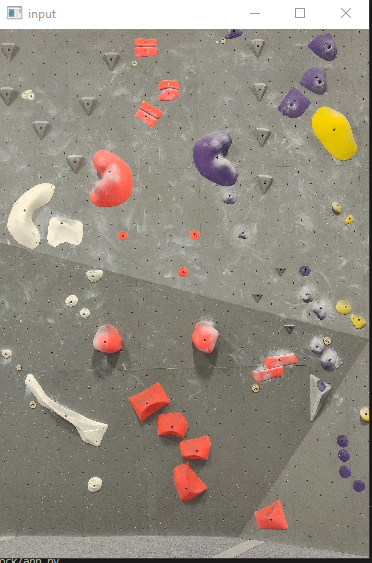
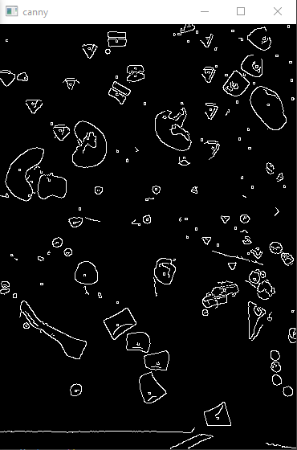
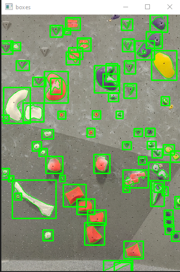

<!-- <figure>
    
    <figcaption align="center"> Some Weyl cones and Feynman diagrams. </figcaption>
</figure>
 -->

## WORK IN PROGRESS

## [Bouldering Routes ratings](https://github.com/matthewRindner/passion_rock)
The goal is re-grade bouldering routes using the V# (V0-V10) scale by the type of each rock holds in a given route. OpenCV is used to extract the rock from an image using edge detection and image processing. 
Pytorch will be used to train a model in 5 classifications of common boulder holds: Pockets, Slopers, Crimps, Jugs, and Footholds.

This project will allow new ways to train climbers and help introduce new climbers with strategy/technique as well as rationalize the ratings assigned to routes and increase rating accuracy based on the intrinsic difficulty of the holds per route.

 

    

        
        <figcaption align="center"> Input Image </figcaption>
    

    

        
        <figcaption align="center"> Extracted Contours </figcaption>
    

    

        
        <figcaption align="center"> Associating rocks with route </figcaption>
    

------

## Project 2

------

## Talks
<!-- - [Introduction to (Qiskit) Quantum Machine Learning](/files/QML_slides.pdf) (2022)  
  Talk given in [Qiskit Fall Fest 2022](https://qiskit.org/events/fall-fest/) at CWRU, which I also co-organized. -->

------

